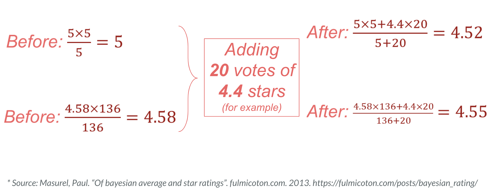

# NYC Airbnb Analysis
*Group Member: Chengyu Wu, Yijing Lin, Lingqin Yang, Zhexin Hu.*

## The project aims to
* Identify characteristics that contribute to the popularity of Airbnb listing in New York City.
* Help Airbnb listing owners improve listing popularity.

## Data Collection
* Web scraping from Airbnb: BeautifulSoup, Webdriver, Json, Pickle, Pandas, Numpy.
* Google Maps API: Places API Nearby Search.
* CSV of crime information in NYC: Pandas, Numpy.

## Data Analysis: Popularity

## Overview of NYC rating distribution

